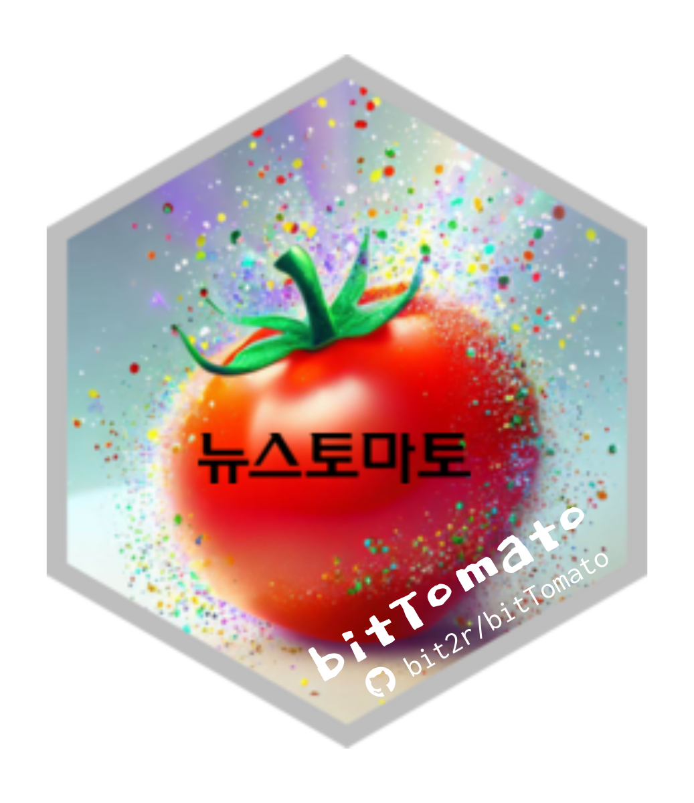

---
output:
  github_document
---

<!-- README.md is generated from README.Rmd. Please edit that file -->

```{r, echo = FALSE}
knitr::opts_chunk$set(
  collapse = TRUE,
  comment = "#>",
  fig.path = "figures/README-"
)
```

# bitTomato 

bitTomato는 "한글 텍스트 데이터 분석의 학습을 위한 실 데이터를 오픈소스로 제공"한다는 목적에 공감하는 뉴스토마토가 제공한 뉴스 기사를, 한국 R 사용자회가 저작 배포하는 R 패키지입니다.   

## 이력

- 2023-06-07: 뉴스토마토와 한국 R 사용자회 "데이터 제공 및 이용에 관한 협약서" 체결
- 2023-07-07: 뉴스토마토 뉴스 원본 데이터 한국 R 사용자회 전달
- 2023-07-17: GitHub 저장소 생성 (`bit2r/bitTomato`)
- 2023-07-22: bitTomato 패키지 github 최초 공개

## 데이터 현황

- 토마토(tomato) 데이터
    - 기간: 2020.01.01 ~ 2022.12.31 (3년치)
    - 건수: 160,936
    - 기사내용: 기사 제목과 본문
    - 개별 기사 메타데이터: 
        - 기사 원문 URL
        - 기사 작성 일시
        - 기사 작성자
        - 기사 중분류
        - 기사 분류
    - 데이터셋 이름: tomato    
- 방울토마토(cherry tomato) 데이터
    - 토마토 데이터셋에서 정치, 산업, 사회 3개 카테고리 각 100건 샘플
    - 건수: 300
    - 데이터셋 이름: cherry_tomato
- 못생긴 토마토 데이터
    - 상품성이 떨어지지만 무농약 친환경 데이터셋
        - 토마토 데이터보다 상대적으로 정제가 덜된 기사 데이터로,
        - 다른 컬럼은 토마토 데이터와 동일함
        - 데이터 정제를 좀더 학습하기 위한 사용자용 데이터
    - **패키지에는 포함되지 않으며, github 리파지토리의 orign_data 디렉토리에 배포**
        - 패키지 설치에 포함되지 않으므로 사용을 위해서는,
        - 별도로 tomato_origin.rda 파일을 다운로드해야 함

## 설치

github 리파지토리로부터 다음의 명령어로 패키지를 설치합니다.:

```{r}
#| eval: false
devtools::install_github("bit2r/bitTomato")
```

## 고마운 분들

bitTomato는 다음 오픈소스 기여자의 리소스를 사용하거나 참조하였습니다.: 

* 뉴스토마토
  - [뉴스토마토 홈페이지](https://www.newstomato.com/){target='_blank'}

  
## 도움요청

bitTomato의 발전을 위해서 버그에 대한 리포팅, 기능 개선을 위한 요구사항들은 [여기에](https://github.com/bit2r/bitTomato/issues){target='_blank'}에 문제를 제기하거나 요청해주세요. 특히 버그는 최소한의 재현 가능한 예제와 함께 제출바랍니다.

## 기여자 행동 강령

이 프로젝트는 [Contributor Code of Conduct(기여자 행동 강령)](https://github.com/bit2r/bitTomato/blob/main/CONDUCT.md){target='_blank'}과 함께 릴리스되었습니다. 이 프로젝트에 참여함으로써 귀하는 해당 조건을 준수하는 데 동의하는 것입니다. 


